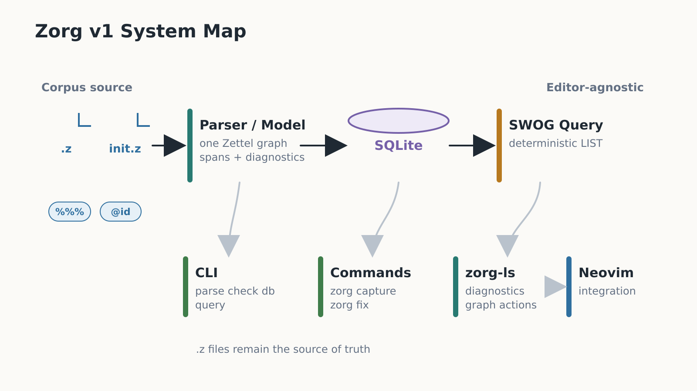

# Zorg

Zorg is an editor-agnostic plaintext zettelkasten built around one primitive:
the zettel. The v1 MVP uses `.z` files under `~/zorg`, a Rust CLI and library
workspace, a Tree-sitter grammar, SQLite indexing, SWOG LIST queries, `zorg-ls`,
capture/fix commands, and a Neovim frontend.

This repository owns the Rust implementation and the shared product contract.
It contains the Rust parser/model, SQLite store, SWOG query engine, CLI,
capture/fix workflow, LSP server, shared documentation, and canonical fixtures
that Tree-sitter and Neovim integrations consume.

The system map below shows how `.z` source files flow through the Rust model,
index, query engine, command-line tools, and editor integration boundaries.



## Non-Negotiable MVP Contract

- Canonical source files use `.z`.
- The default corpus root is `~/zorg`.
- File zettel headers use `%%% @foo ... %%%`.
- Directory zettel are `init.z`.
- IDs are `@foo`; local IDs are `^bar`, resolved under the nearest ancestor ID
  as `@ancestor/bar`.
- Links are absolute `#foo/bar`, child-relative `+child`, and sibling-relative
  `~sibling`.
- Type tags use `#z/...`.
- Properties use `key::value`; slash-separated list values are the v1 list form.
- Lifecycle properties are `do::`, `due::`, and `did::`.
- Timebox properties are `p::`, `start::`, and `end::`.
- Todos are `[ ]`, `[N]`, `[X]`, and `[?]`.
- Code blocks are ordinary Markdown fences.
- Query output supports SWOG LIST, minimal TABLE, and `count()` aggregate
  results.
- Query and template definitions are ordinary zettel tagged `#z/query` and
  `#z/tmpl`.

Legacy Python-era syntax is not supported as readable or writable v1 syntax.
That includes `.zo`, `.zoq`, `.zot`, `ID::`, `LID::`, `tick::`, generated
`.zoc`, custom `@@@` fences, old folgezettel IDs, tag sugar, and Python-era link
behavior.

## Documentation Map

- `docs/syntax.md`: `.z` syntax and explicit no-legacy policy.
- `docs/model.md`: semantic zettel model, IDs, hierarchy, links, tags,
  properties, todos, diagnostics, and source spans.
- `docs/query.md`: SWOG LIST/TABLE/count Query v1.1 contract, filters,
  ordering, query zettel execution, and deferred query behavior.
- `docs/lsp.md`: `zorg-ls` MVP boundaries, diagnostics, source-span
  expectations, rename safety, and root handling.
- `docs/capture.md`: `#z/tmpl` template discovery, capture destinations,
  source-file recording, and noninteractive CLI expectations.
- `docs/import_export.md`: explicit legacy import and Markdown export bridge
  contract; bridge formats are not normal v1 source syntax.
- `docs/fix.md`: strict check mode, allowed autofixes, idempotency, and
  unsupported legacy diagnostics.
- `docs/development.md`: Rust workspace layout, crate boundaries, and
  validation commands.
- `docs/cross_repo.md`: cross-repo ownership, naming alignment, fixture
  synchronization, validation results, and handoff notes.
- `docs/release.md`: MVP versioning, changelog, binary packaging, generated
  parser policy, and dry-run release checklist.

The concept diagrams embedded throughout these docs live under
`docs/assets/infographics/`. They are referenced from the sections they support
rather than collected as a separate gallery.

## Build From Source

Build from this repository root with a Rust toolchain that supports Rust 2024:

```bash
cargo build --workspace
cargo run -p zorg-cli -- --help
cargo run -p zorg-ls -- --version
```

`crates/zorg-parse` consumes the generated parser from the sibling
`../zorg-treesitter` checkout. If `../zorg-treesitter/src/parser.c` is missing
or stale, run this before building the Rust workspace:

```bash
(cd ../zorg-treesitter && npm install && npm run generate)
```

For local command-line use, install both binaries from source:

```bash
cargo install --path crates/zorg-cli
cargo install --path crates/zorg-ls
```

## Fixtures

`fixtures/corpus` is the canonical cross-repo fixture corpus. Keep it small and
representative. The Rust parser/model, Tree-sitter grammar, Neovim plugin, LSP,
query, capture, and fix tests should reuse these files before adding local
copies.

`fixtures/import_export` holds import/export bridge fixtures. Legacy files in
that tree are explicit import inputs only, and expected `.z` or Markdown files
there are golden outputs rather than accepted corpus fixtures.

See `fixtures/README.md` for the fixture inventory and policy.

## CLI Quick Start

The examples below run against the checked-in fixture corpus. Use `--root
~/zorg` or omit `--root` when working against your real Zorg corpus.

Parse one `.z` source file as a semantic JSON model:

```bash
cargo run -p zorg-cli -- parse fixtures/corpus/minimal.z
```

Run strict validation on files or a whole corpus:

```bash
cargo run -p zorg-cli -- check fixtures/corpus/minimal.z
tmp_check="$(mktemp -d)"
cp fixtures/corpus/minimal.z fixtures/corpus/nested.z "$tmp_check/"
cargo run -p zorg-cli -- check --root "$tmp_check"
```

Inspect and refresh the SQLite store. Pass `--db PATH` when you want an
explicit database outside the default root-managed location:

```bash
tmp_db="$(mktemp -u)"
cargo run -p zorg-cli -- db status --root fixtures/corpus --db "$tmp_db"
cargo run -p zorg-cli -- db reindex --root fixtures/corpus --db "$tmp_db"
```

Preview legacy import output without writing files:

```bash
cargo run -p zorg-cli -- import legacy plan fixtures/import_export/legacy/notes/project.zo
cargo run -p zorg-cli -- import legacy plan fixtures/import_export/legacy --format json
```

Apply legacy import output only into an explicit temporary root:

```bash
tmp_import="$(mktemp -d)"
cargo run -p zorg-cli -- import legacy apply fixtures/import_export/legacy/notes/project.zo --root "$tmp_import"
cargo run -p zorg-cli -- check --root "$tmp_import"
```

Export canonical zettels to Markdown from a current index:

```bash
tmp_db="$(mktemp -u)"
cargo run -p zorg-cli -- db reindex --root fixtures/corpus --db "$tmp_db"
cargo run -p zorg-cli -- export markdown --id @minimal --root fixtures/corpus --db "$tmp_db"
cargo run -p zorg-cli -- export markdown --query '#z/todo' --out /tmp/zorg-md --root fixtures/corpus --db "$tmp_db"
```

Keep the store current while editing a corpus with the live watcher. Text mode
is for humans; JSON mode prints one event object per line for editor jobs:

```bash
tmp_db="$(mktemp -u)"
cargo run -p zorg-cli -- watch --root fixtures/corpus --db "$tmp_db"
cargo run -p zorg-cli -- watch --root fixtures/corpus --db "$tmp_db" --format json
```

`zorg db reindex` remains the batch and CI command path. `zorg watch` also has
bounded smoke-test flags: `--exit-after-ready`, `--once`, and
`--exit-after-events N`.

`zorg dash` is the terminal work surface for the current index. Its interactive
help includes row-level yank actions: press `y` to copy a row ID, source link,
or diagnostic message when available. Clipboard transport prefers OSC 52 in a
terminal and falls back to local clipboard commands; when neither is available,
the dashboard keeps the selected value visible in its log overlay.

Store-aware commands resolve paths with this precedence: CLI flags,
`ZORG_ROOT` / `ZORG_DATABASE_PATH` environment variables, root-local
`.zorg/config.toml`, user config at `$XDG_CONFIG_HOME/zorg/config.toml` or
`~/.config/zorg/config.toml`, then the default `~/zorg` root with
`<root>/.zorg/zorg.sqlite3`. `zorg db status` is the quickest way to inspect
the final line-oriented `root:` and `database:` values.

SWOG LIST, minimal TABLE, and `count()` aggregate queries run against the
SQLite index for a corpus root:

```bash
tmp_db="$(mktemp -u)"
cargo run -p zorg-cli -- db reindex --root fixtures/corpus --db "$tmp_db"
cargo run -p zorg-cli -- query '#z/todo -did:*' --root fixtures/corpus --db "$tmp_db"
cargo run -p zorg-cli -- query 'TABLE #z/todo' --root fixtures/corpus --db "$tmp_db"
cargo run -p zorg-cli -- query 'count(#z/todo)' --root fixtures/corpus --db "$tmp_db"
cargo run -p zorg-cli -- query --id @query-fixture/queries/daily --root fixtures/corpus --db "$tmp_db"
```

The CLI supports boolean OR and parenthesized expressions, and rejects deferred
aggregation beyond `count()`, custom TABLE columns, and functions with explicit
parser errors. See `docs/query.md` for the full Query v1.1 contract.

Resolve a canonical zettel ID to the exact indexed source location. This is the
stable editor jump contract; `zorg open` is an alias with the same behavior:

```bash
cargo run -p zorg-cli -- path @minimal --root fixtures/corpus --db "$tmp_db"
cargo run -p zorg-cli -- open @minimal --format json --root fixtures/corpus --db "$tmp_db"
```

Preview structural refactors before writing. `promote`, `move`, and `extract`
share the same JSON preview envelope for editor confirmation. Use temporary
copies for write mode because these commands edit source files:

```bash
cargo run -p zorg-cli -- promote @project/plan --format json --root "$tmp_root" --db "$tmp_db"
cargo run -p zorg-cli -- move @project/plan --to archive/project-plan.z --format json --root "$tmp_root" --db "$tmp_db"
cargo run -p zorg-cli -- extract --file notes.z --range 12:1-14:1 --id @notes/extracted --format json --root "$tmp_root" --db "$tmp_db"
```

Check or apply deterministic autofixes. The write example uses a temporary copy
because `zorg fix` edits files in place:

```bash
cargo run -p zorg-cli -- fix --check fixtures/corpus/autofix_fixed.z
tmp_fix="$(mktemp -d)/autofix_unfixed.z"
cp fixtures/corpus/autofix_unfixed.z "$tmp_fix"
cargo run -p zorg-cli -- fix "$tmp_fix"
```

Create a zettel from a `#z/tmpl` template. This example writes to a temporary
copy because capture is intentionally a write command:

```bash
tmp_root="$(mktemp -d)"
cp fixtures/corpus/query_and_template.z "$tmp_root/query_and_template.z"
cargo run -p zorg-cli -- db reindex --root "$tmp_root"
cargo run -p zorg-cli -- capture \
  --root "$tmp_root" \
  --template @system/templates/todo \
  --id @inbox/follow-up \
  --title "Follow up" \
  --source "README example" \
  --body "Write next action."
```

Launch the terminal dashboard over an indexed corpus. The dashboard reads the
SQLite store read-only for normal browsing; run `zorg db reindex` or
`zorg watch` separately to keep the index current. Inside the dashboard, `r`
refreshes, `R` confirms a reindex, `/` edits Search, `enter` runs selected saved
queries or opens source outside Queries, `o` opens `$EDITOR`, and `c` captures
through the same `zorg-capture` boundary shown above. Mouse
capture is off by default; pass `--mouse` only when intentionally opting in:

```bash
cargo run -p zorg-cli -- dash --root "$tmp_root" --panel today
cargo run -p zorg-cli -- dash --root "$tmp_root" --panel search --query '#z/inbox'
cargo run -p zorg-cli -- dash --root "$tmp_root" --once
cargo run -p zorg-cli -- dash --root "$tmp_root" --mouse
```

Editors start the language server over stdio with no arguments and pass root
and database settings during LSP initialization. `zorg-ls --help` and
`zorg-ls --version` are normal command-line checks:

```bash
cargo run -p zorg-ls -- --help
cargo run -p zorg-ls -- --version
```

## Rust Validation

Run the Rust validation commands from this repository root:

```bash
python3 tools/check_fixture_manifest.py
cargo fmt --check
cargo test --workspace
cargo test --workspace mvp_e2e
cargo clippy --workspace --all-targets -- -D warnings
```

`cargo test --workspace mvp_e2e` is the named Rust MVP end-to-end harness. It
uses temporary `~/zorg`-like roots and explicit database paths to cover parse,
strict legacy rejection, reindex, inline and query-zettel SWOG queries, JSON
legacy import plan/apply, Markdown export selectors, capture, fix,
`fix --check`, and `zorg-ls` diagnostics/navigation actions without requiring
or modifying a developer's real `~/zorg`.

## Large-Corpus Baseline

Generate a deterministic synthetic corpus and record store/query/dashboard
baseline metrics with:

```bash
tmp_parent="$(mktemp -d)"
python3 tools/generate_large_corpus.py --output "$tmp_parent/corpus" --files 1000 --zettels-per-file 4 --seed 10
cargo build -p zorg-cli
python3 tools/perf_large_corpus.py --root "$tmp_parent/corpus" --db "$tmp_parent/zorg-perf.sqlite3" --zorg-bin target/debug/zorg
```

The generator writes valid `.z` files with IDs, nested zettel, tags,
properties, todos, links, query definitions, and queryable body text. The
baseline command runs `zorg check`, full `zorg db reindex`, `zorg db status`, a
single-file incremental reindex after mutating one generated `.z` file, and a
query. It also renders dashboard Today and Index `--once` frames and runs a
PTY-backed bounded dashboard startup with `--exit-after 50 --no-alt-screen`.
The helper prints line-oriented counts, byte counts, and timings. Treat elapsed
times as manual regression signals, not fixed CI thresholds.

## Cross-Repo Validation

Run the full local MVP gate from this repository root when validating Rust,
Tree-sitter, and Neovim together:

```bash
tools/validate_cross_repo.sh
```

The command expects sibling `../zorg-treesitter` and `../zorg-nvim` checkouts,
checks required local tools and sibling repo shape, then runs the Rust
workspace checks, Tree-sitter generation/query/shared-fixture checks, and
Neovim headless tests. Its full Rust workspace test step is serialized so the
stdio LSP smoke tests cannot interfere with each other.
`tools/validate_cross_repo.sh --help` prints the exact usage and path
overrides.

The gate uses fixture roots and explicit temporary database paths through the
Rust and Neovim tests. It must not read or mutate a developer's real `~/zorg`
corpus. The Tree-sitter shared-fixture step parses only manifest entries marked
valid and fails if the parser emits recovered `ERROR` or `MISSING` nodes.

## Release Dry Run

The MVP release process is defined in `docs/release.md`. To verify the release
checklist without tagging, pushing, uploading, publishing, or changing
versions, run:

```bash
tools/release_dry_run.sh
```

The dry run requires clean Rust, Tree-sitter, and Neovim worktrees. It uses the
cross-repo validation gate as the pre-release check, builds local release
binaries, assembles a temporary host archive, verifies its checksum, inspects
package/archive outputs, and removes temporary artifacts by default.

## Related Repositories

- `../zorg`: this repo; Rust CLI, libraries, shared docs, and fixtures.
- `../zorg-treesitter`: Tree-sitter grammar and editor query files.
- `../zorg-nvim`: Neovim plugin and user-facing editor integration.

## Current Status

The Rust workspace now has the parser/model foundation, SQLite store indexing,
SWOG LIST/TABLE query evaluation, inline `zorg query`, and query-by-`#z/query` ID
execution. `zorg-ls` now exposes the MVP language-server surface over stdio,
including live diagnostics, indexed graph navigation, symbols, completion,
safe rename planning, and deterministic quick fixes when the store index is
ready. Capture and strict fix/check behavior are implemented for the MVP
workflow and covered by CLI integration tests.
