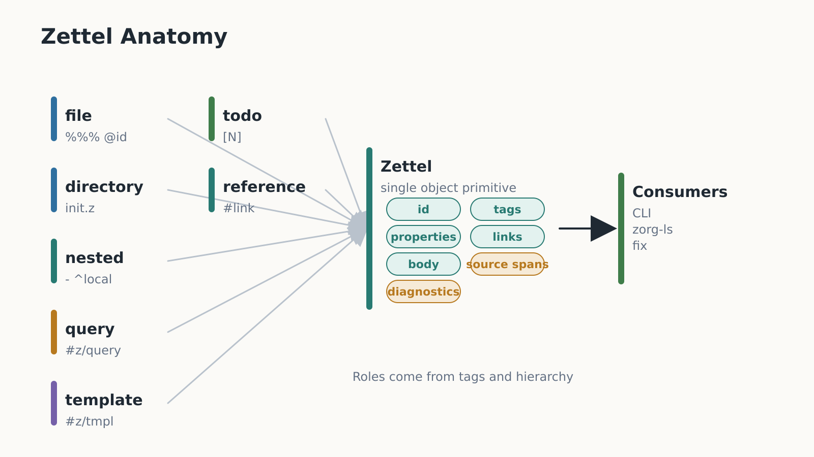
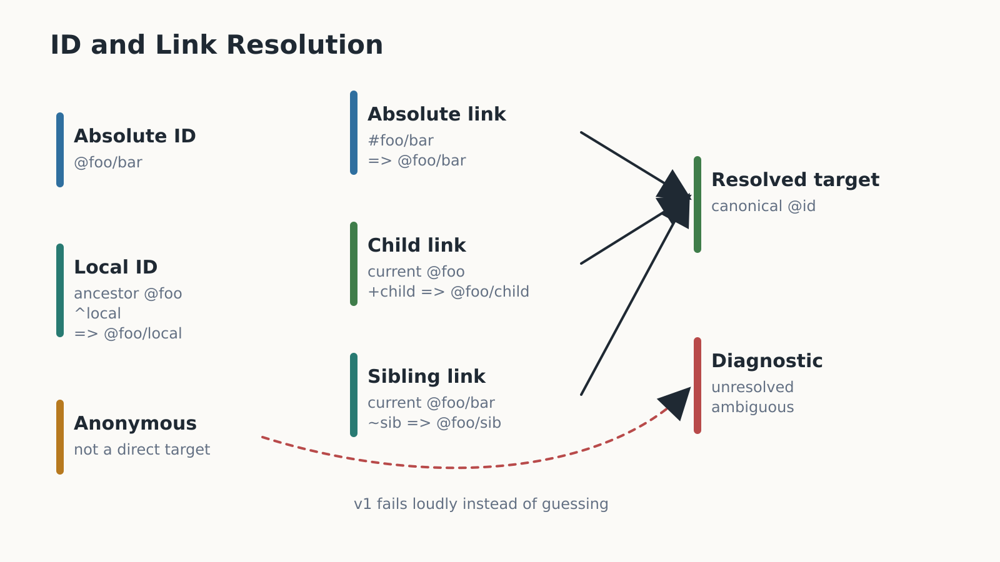
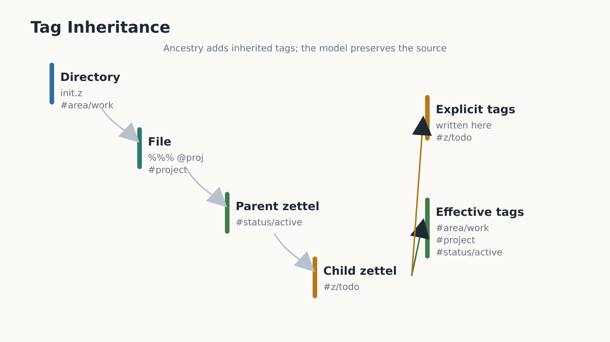

# Zorg v1 Semantic Model

The semantic model lowers `.z` syntax into a typed zettel graph while preserving
source spans for diagnostics, LSP, fix operations, and editor integrations.

## Core Entities

A `Zettel` is the single object primitive. Each zettel has:

- `kind`: `file`, `directory`, or `nested`.
- `id`: optional absolute ID such as `@alpha/beta`.
- `local_id`: optional local declaration such as `^beta`.
- `title`: optional plain text from the zettel opening/header.
- `type_tags`: zero or more `#z/...` tags.
- `tags`: explicit non-type tags.
- `inherited_tags`: tags inherited from path and parent zettel ancestry.
- `properties`: ordered key/value entries.
- `todo`: optional `[ ]`, `[N]`, `[X]`, or `[?]` marker.
- `links`: outgoing unresolved and resolved references.
- `body`: source-backed body text and child zettel.
- `source`: file path and byte/line/column spans.
- `diagnostics`: validation findings attached to source spans.

Files, directories, query definitions, templates, references, inbox notes, and
todos all use this same `Zettel` structure. Type tags and hierarchy distinguish
roles.

The anatomy diagram summarizes how different source forms lower into the same
semantic `Zettel` object.

## Hierarchy

The root corpus is `~/zorg` by default, with CLI and LSP configuration able to
override it. Only `.z` files are canonical Zorg source files. A directory zettel
is represented by `init.z` within that directory.

Hierarchy is derived from:

- Directory ancestry under the corpus root.
- File zettel headers.
- Nested zettel indentation/list structure.

A nested zettel's parent is the nearest enclosing zettel. A file body belongs to
the file zettel declared by its header. A directory `init.z` file represents the
directory itself and can parent descendant files for inheritance purposes.

## IDs

Absolute IDs are canonical without the leading reference marker. For display,
they include the declaration marker, such as `@foo/bar`. Link references use
`#foo/bar`.

Local IDs resolve under the nearest ancestor zettel with an absolute ID:

- Ancestor `@foo`, declaration `^bar`, canonical ID `@foo/bar`.
- Ancestor `@foo/baz`, declaration `^bar`, canonical ID `@foo/baz/bar`.

Duplicate canonical IDs are diagnostics. A local ID without an ID-bearing
ancestor is a diagnostic. Anonymous zettel are allowed but cannot be direct link
targets until they receive an ID.

The ID resolution diagram separates declarations, relative references, resolved
canonical targets, and diagnostic fallbacks.

## Links

The model stores the written link and, after resolution, the target canonical ID
or an unresolved diagnostic.

Resolution rules:

- `#foo/bar` resolves directly to `@foo/bar`.
- `+child` resolves under the current zettel's canonical ID.
- `~sibling` resolves under the parent path of the current zettel's canonical
  ID, falling back to the source parent zettel's canonical ID when the current
  canonical ID has no path parent.

If a relative link cannot identify the current or parent ID context, strict
checks should report a diagnostic. Ambiguous resolution must fail loudly; v1
does not guess based on old folgezettel or Python-era behavior.

## Tags

Tags are explicit when written on a zettel. Type tags are explicit tags in the
reserved `#z/...` namespace, with semantic meaning assigned by consumers.

Inherited tags are derived from directory/file/parent zettel ancestry. The model
must distinguish explicit tags from inherited tags so queries and LSP features
can answer both "written here" and "effective on this zettel" questions.

The tag inheritance diagram shows ancestry contributing effective tags while
preserving which tags were written explicitly.

Link-target inheritance, tag opt-out syntax, and tag sugar are deferred.

## Properties

Properties are ordered key/value pairs attached to the containing zettel.
Duplicate keys are allowed syntactically; semantic consumers may diagnose
duplicates for keys that must be singular.

Known properties for v1:

- Lifecycle dates: `do`, `due`, `did`.
- Timebox fields: `p`, `start`, `end`.
- Query/template fields: `query`, `title`, `dest`, `source`.

Slash-separated property values may be interpreted as lists by query and model
code. Comma lists and repeated bullet list values are deferred.

## Todos

Todo markers attach to zettel, not to a separate task entity. A zettel with a
todo marker may also have `#z/todo`, lifecycle properties, links, tags, and
children. Query code should be able to filter by todo marker and by type tag.

## Diagnostics

Diagnostics must include file path, severity, message, and source span. MVP
diagnostics should cover:

- Malformed or missing file header where a header is required.
- Duplicate canonical IDs.
- Unresolved absolute, child-relative, sibling-relative, or local references.
- Invalid property syntax or invalid typed value for known properties.
- Unsupported legacy-looking syntax such as `.zo`, `ID::`, `LID::`, `tick::`,
  `@@@` fences, `.zoq`, `.zot`, `.zoc`, or old folgezettel IDs.

Syntax parsers may recover to preserve spans, but semantic consumers must not
silently translate legacy input into v1 model objects.

`zorg parse` may emit a model JSON document with recoverable diagnostics
attached. Strict validation APIs and `zorg check` treat error diagnostics as a
failure status while still preserving source-backed diagnostic details for
callers and editor integrations.

## Source Spans

Every syntax primitive that can produce diagnostics or editor actions must carry
a source span:

- IDs and local IDs.
- Links.
- Tags and type tags.
- Property keys and values.
- Todo markers.
- Zettel opening/header regions.
- Fenced code blocks used for query and template bodies.

Spans should be byte based for storage and line/column translated for LSP.
