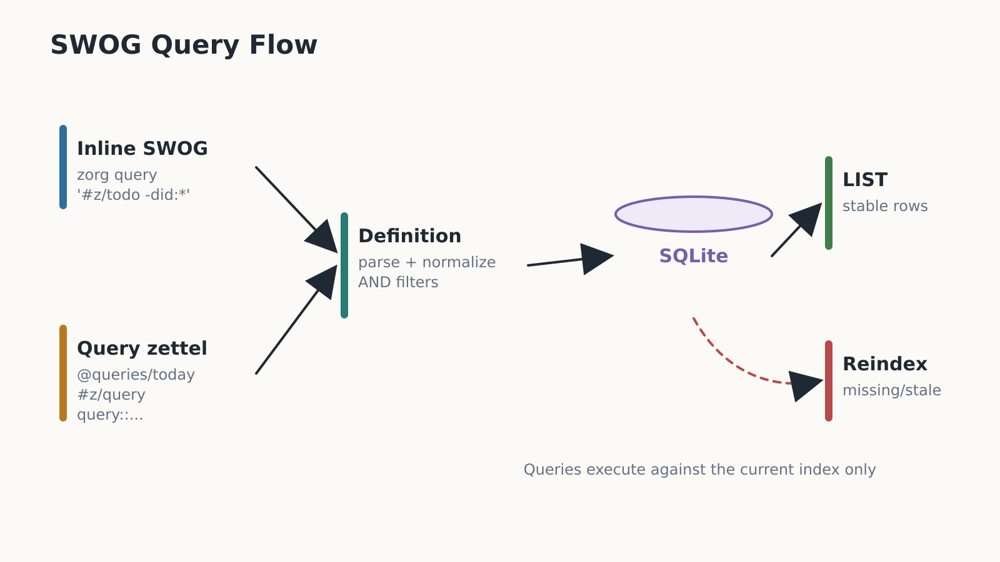

# Zorg v1 Query Contract

Zorg v1.1 supports SWOG LIST, minimal TABLE, and `count()` aggregate query
output. The query engine reads the indexed zettel graph and returns ordered
zettel results or named aggregate values. Text filters execute through the
SQLite FTS index when querying a current store. Broad aggregation, custom
functions, saved dot-snippets, and alternate renderers are deferred.

## Command Sequence

Use an existing, current SQLite index for query execution. Reindex after source
files change:

```bash
tmp_db="$(mktemp -u)"
cargo run -p zorg-cli -- db reindex --root fixtures/corpus --db "$tmp_db"
cargo run -p zorg-cli -- query '#z/query' --root fixtures/corpus --db "$tmp_db"
cargo run -p zorg-cli -- query --id @query-fixture/queries/daily --root fixtures/corpus --db "$tmp_db"
cargo run -p zorg-cli -- query '#z/query' --format json --root fixtures/corpus --db "$tmp_db"
cargo run -p zorg-cli -- query 'TABLE #z/todo' --root fixtures/corpus --db "$tmp_db"
cargo run -p zorg-cli -- query 'count(#z/todo)' --root fixtures/corpus --db "$tmp_db"
```

Pass `--db PATH` to keep the database outside the default location:

```bash
cargo run -p zorg-cli -- db reindex --root fixtures/corpus --db /tmp/zorg.sqlite3
cargo run -p zorg-cli -- query '#z/todo -did:*' --root fixtures/corpus --db /tmp/zorg.sqlite3
```

If the database is missing or stale, `zorg query` exits nonzero and tells the
user to run `zorg db reindex` for the selected root and database path.

`zorg export markdown --query '<swog>'` and
`zorg export markdown --query-id @some/query` reuse the same current-index guard
and query execution order, then render the selected canonical zettels to
Markdown. Aggregate `count()` queries are not export selectors.

`zorg path @id` is the read-only editor jump contract for canonical zettel IDs.
It uses the same root/database resolution and current-index requirement as
`zorg query`; it never reindexes implicitly and never writes source files. The
human output is one stable location line:

```text
/absolute/root/main.z:5:1 @project/plan Plan the next milestone.
```

`zorg open @id` is an alias for clients that model the operation as opening a
file. Both commands accept `--root`, `--db`, `--json`, and `--format json`.
JSON output is a single schema-versioned object:

```json
{
  "schema_version": 1,
  "command": "path",
  "canonical_id": "project/plan",
  "absolute_path": "/absolute/root/main.z",
  "root_relative_path": "main.z",
  "source_span": {
    "start_byte": 42,
    "end_byte": 104,
    "start_line": 5,
    "start_column": 1,
    "end_line": 5,
    "end_column": 63
  },
  "title": "Plan the next milestone.",
  "kind": "nested"
}
```

Invalid IDs, missing index snapshots, stale snapshots, missing targets,
ambiguous canonical IDs, and indexed rows without source line/column data exit
nonzero with a message on stderr. Editor clients should use the absolute path
plus one-based `source_span.start_line` and `source_span.start_column`.

The query flow diagram shows inline SWOG and `#z/query` definitions executing
only against a current SQLite index before rendering deterministic `LIST` rows.



## Query Location

Queries can run from the CLI as an inline SWOG string or from ordinary zettel
tagged `#z/query`.

Query zettel definitions may use:

- A `query::` property for short definitions.
- A fenced `swog` block in the zettel body for longer definitions.

If both exist, v1 consumers should report an ambiguous query definition rather
than guessing.

## Result Shape

The default output form is LIST. A query that starts with `TABLE ` selects the
minimal TABLE form. A query written as `count(<query expression>)` selects the
minimal aggregate form. JSON is the versioned machine-readable contract for
editor clients and scripts. Request JSON with `--json` or `--format json`.

Each row represents one matching zettel and includes enough identity to
navigate back to source: canonical ID when present, file path, title or first
body line, todo marker when present, source order, store row ID, source span,
effective tags, and indexed properties.

The stable LIST renderer emits one line per row:

```text
<todo> <identity>  <path>  <title>
```

- `<todo>` is the stored todo marker such as `[ ]`, `[N]`, `[X]`, or `[?]`.
  Rows without a todo marker reserve the same three-character column.
- `<identity>` is `@canonical/id` when the zettel has a canonical ID, or `-`
  when it does not.
- `<path>` is the root-relative source path with `/` separators.
- `<title>` is the title or first meaningful body line with whitespace
  normalized for one-line terminal output.

Identity and path columns are padded to the widest row in the result set so the
title column is stable and easy to scan. Empty result sets render as no rows.

Example:

```text
[ ] @project/plan  nested.z   Plan the next Zorg milestone.
    @minimal       minimal.z  Minimal fixture
```

Default ordering should be deterministic:

1. Explicit query order if the query includes one.
2. Due/do date where lifecycle or todo filters are present.
3. Source path.
4. Source order within the file.
5. Stable store row ID as a final tie-breaker.

JSON output uses a stable envelope:

```json
{
  "schema_version": 1,
  "kind": "list",
  "query_source": "inline",
  "query": "#z/todo",
  "query_zettel": null,
  "rows": [
    {
      "store_row_id": 12,
      "canonical_id": "project/plan",
      "path": "nested.z",
      "title": "Plan the next Zorg milestone.",
      "todo_marker": "[ ]",
      "source_order": 1,
      "span": {
        "start_byte": 42,
        "end_byte": 104,
        "start_line": 5,
        "start_column": 1,
        "end_line": 5,
        "end_column": 63
      },
      "tags": ["z/todo"],
      "properties": [{ "key": "area", "value": "work/zorg" }]
    }
  ],
  "diagnostics": []
}
```

When running with `--id @some/query`, `query_source` is `zettel` and
`query_zettel` contains the query zettel ID without `@`, root-relative source
path, extracted query text, and the source span for that query definition.
Empty JSON result sets return the same envelope with an empty `rows` array.

TABLE output uses the same filter expression grammar after the leading
`TABLE ` keyword:

```swog
TABLE (#z/todo OR #z/query)
```

The initial TABLE contract has fixed default columns: `todo`, `id`, `file`,
and `title`. Custom column lists, custom functions, and aggregate expressions
are rejected with unsupported-feature parser errors.

Text TABLE output includes a header, separator, and padded cells:

```text
Todo  ID             File      Title
----  -------------  --------  -----------------------------
[ ]   @project/plan  nested.z  Plan the next Zorg milestone.
```

TABLE JSON uses the same envelope fields as LIST, changes `kind` to `table`,
adds `columns`, and emits one object per row keyed by the default columns:

```json
{
  "schema_version": 1,
  "kind": "table",
  "query_source": "inline",
  "query": "TABLE #z/todo",
  "query_zettel": null,
  "columns": [
    { "key": "todo", "label": "Todo" },
    { "key": "id", "label": "ID" },
    { "key": "file", "label": "File" },
    { "key": "title", "label": "Title" }
  ],
  "rows": [
    {
      "todo": "[ ]",
      "id": "@project/plan",
      "file": "nested.z",
      "title": "Plan the next Zorg milestone."
    }
  ],
  "diagnostics": []
}
```

Aggregate output currently supports only `count(<query expression>)`. The inner
expression uses the same boolean/filter grammar as LIST and TABLE:

```swog
count(#z/todo OR #z/query)
```

Text aggregate output is one script-friendly line:

```text
count 3
```

Aggregate JSON uses the same envelope fields as LIST, changes `kind` to
`aggregate`, and emits named values instead of row data:

```json
{
  "schema_version": 1,
  "kind": "aggregate",
  "query_source": "inline",
  "query": "count(#z/todo)",
  "query_zettel": null,
  "values": {
    "count": 3
  },
  "diagnostics": []
}
```

## Supported Filters

The parser supports these filter families. Whitespace between filters means
logical AND, and unquoted values end at whitespace unless noted below.

- Property equality: `foo:bar`.
- Property comparison: `p:>3`, `due:<=2026-05-15`, `due:<=today`.
- Property existence: `foo:*`.
- Tag filters: `#z/todo`, `#area/work`.
- Link filters: `links:#foo/bar`.
- File glob filters: `file:projects/*.z`.
- Todo status and priority: `todo:[ ]`, `todo:[N]`, `todo:[X]`, `todo:[?]`.
- Negation: `-#z/inbox`, `-did:*`, or a negated group such as
  `-(#z/inbox OR #area/archive)`.
- Text search: quoted phrases such as `"alpha beta"` or an explicit
  `text:alpha` / `text:"alpha beta"` filter. Store-backed text filters search
  indexed title, body, and combined raw text through SQLite FTS.
- Relative modify-date ranges: `modified:<7d`, `modified:>=30d`.

Representative CLI examples:

```bash
zorg query '#z/todo -did:*'                         # daily active todo list
zorg query '#z/inbox -did:*'                        # inbox
zorg query 'due:<=today -did:*'                     # due today or overdue
zorg query 'modified:<7d'                           # recently modified notes
zorg query '#area/work'                             # effective tag match
zorg query 'links:#query-fixture/reference'         # outgoing link target
zorg query 'file:query_focus.z text:"alpha text"'   # file and text filters
zorg query 'area:work/zorg todo:[ ]'                # property plus todo marker
zorg query '#z/todo OR #z/query'                    # explicit OR
zorg query '(#z/todo OR #z/query) -did:*'           # grouped OR plus negation
zorg query '#z/todo (#area/work OR #area/personal)' # implicit AND plus grouped OR
zorg query 'TABLE #z/todo'                          # minimal table
zorg query 'count(#z/todo OR #z/query)'             # aggregate count
```

Property keys and reserved field names begin with an ASCII letter and then use
ASCII letters, digits, `_`, or `-`. Tags and link targets are slash-separated
paths whose segments begin with an ASCII letter or digit and then use ASCII
letters, digits, `_`, or `-`.

Quoted strings may contain spaces. Backslash escaping is recognized only inside
quoted strings, so `"alpha \"beta\""` parses as one text phrase.

Boolean expressions use this precedence, from tightest to loosest:

1. Parentheses.
2. Unary negation.
3. Implicit AND from whitespace.
4. Explicit OR.

`OR`, `|`, and `||` are equivalent OR operators. Empty queries, empty quoted
phrases, missing filter values, malformed tags, malformed link targets, invalid
todo markers, missing grouping parentheses, dangling OR operators, and
`modified` filters without a range operator are parser errors.

The parser rejects deferred syntax explicitly:

- TABLE custom columns and custom functions.
- Common aggregation function forms such as `sum(...)`, `avg(...)`, `min(...)`,
  and `max(...)`.

Unknown `key:value` filters are ordinary property filters. Unknown
function-like syntax is not accepted as a property filter.

## Normalized Semantics

Parsed expressions normalize into a query plan before store-backed evaluation:

- `links`, `file`, `todo`, and `modified` are reserved fields.
- `text:` and quoted phrases normalize as text filters.
- `#tag/path` queries materialized effective tags by default.
- Other `key:value` expressions are property filters.

Property comparison values are typed during normalization:

- `p` and numeric-looking values use numeric comparison.
- `do`, `due`, and `did` use date comparison. `today` is resolved from the
  caller-supplied query context rather than reading the system clock directly.
- `start` and `end` use time comparison when written as `HH:MM` or `HH:MM:SS`.
- Unknown properties use string equality. Range comparisons on unknown
  non-numeric values are semantic errors.

Slash-list property equality matches either the full stored value or an exact
slash-separated segment. For example, `area:work` matches `area::work/research`,
and `area:work/research` matches the full value. Range comparisons apply only
to scalar numeric, date, or time values.

Relative modified ranges are age comparisons against the timestamp supplied by
the query context:

- `modified:<7d` means modified within the last seven days.
- `modified:>=30d` means modified at least thirty days ago.

The query context carries the corpus root, local `today` date, current timestamp
for modified-age filters, timezone policy, and an optional current zettel ID for
future relative query behavior.

## Query Zettel Execution

Running a query by ID resolves the target zettel, verifies it has `#z/query`,
extracts its query definition, evaluates against the configured corpus root,
and renders LIST output.

Query zettel are part of the same corpus as every other note. They can have
ordinary IDs, tags, properties, links, children, and source spans. `.zoq` files
are not v1 input.

The shared fixture corpus includes both `query::` and fenced `swog` examples in
`fixtures/corpus/query_focus.z` and `fixtures/corpus/query_and_template.z`.

## Error Handling

Query parser errors should identify the query source span when the query lives
inside a `.z` file and byte/column position when supplied inline. Unknown fields
are allowed as property filters unless their syntax is malformed.

Unsupported TABLE features such as custom columns and unsupported aggregate
functions should produce clear unsupported-feature errors, not partial output.

For stored query execution, errors name the requested zettel ID and source path
when a definition is missing, ambiguous, or invalid. A query zettel must be
explicitly tagged `#z/query`; inherited query tags are not executable in the v1
MVP.

## Deferred Query Features

Deferred beyond v1:

- Broad aggregation beyond `count()`.
- Custom functions.
- Saved query dot-snippets.
- Embedded query pragmas.
- Manual tables as source syntax.
- Query-driven completion hints.
