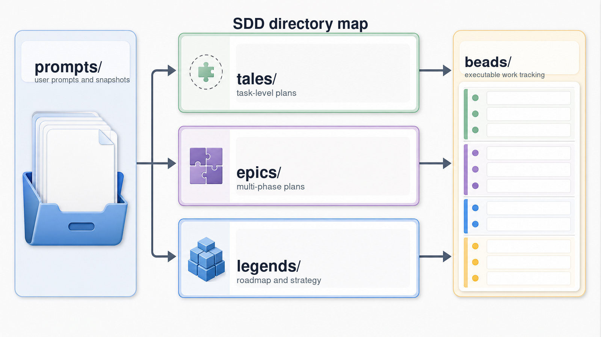

# Structured Development Docs

The `sdd/` directory keeps durable planning context close to the code it describes. It stores prompts, approved plans,
roadmap material, and bead state in predictable paths so humans and agents can reference the same artifacts over time.

## Directory Layout

- `prompts/` stores the original user prompts or expanded prompt snapshots that led to plan-like artifacts.
- `tales/` stores task-level implementation plans and follow-up plans.
- `epics/` stores larger work plans that may be split into phase beads.
- `legends/` stores broad roadmap or strategy artifacts that can spawn epics.
- `beads/` stores bead issue data for SDD-backed work tracking.

Prompt, tale, epic, and legend files are normally organized under a `YYYYMM/` month directory, for example
`sdd/prompts/202605/example.md` and `sdd/tales/202605/example.md`. Prompt files should link to their generated plan-like
artifact with frontmatter such as `plan: sdd/tales/202605/example.md`; the plan-like artifact should link back with
`prompt: sdd/prompts/202605/example.md`.

## Commands

- `sase sdd list` lists SDD markdown artifacts.
- `sase sdd validate` checks frontmatter links between prompts and plan-like artifacts.
- `sase sdd repair-links` infers and repairs missing bidirectional links.
- `sase bead` manages SDD bead issues and epic work.

## Compatibility

The canonical directories are `prompts/`, `tales/`, `epics/`, `legends/`, and `beads/`. Older trees may still contain
`specs/` for prompt snapshots or `plans/` for tale-like plans; SDD tooling keeps limited compatibility for those legacy
names, but new artifacts should use `prompts/` and `tales/`.
